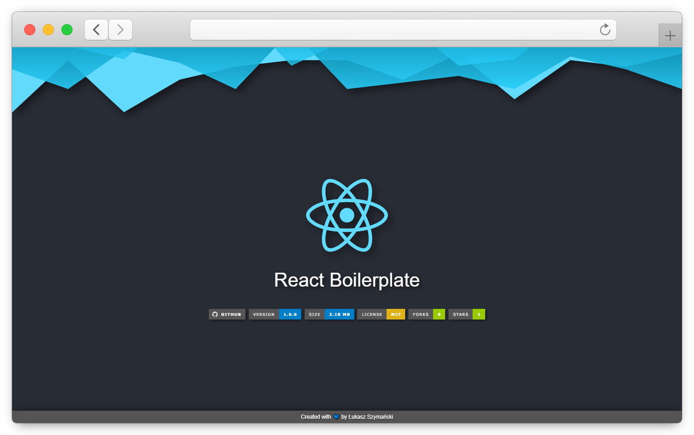

<!-- APPLICATION PREVIEW -->
<div align="center">
  
  
  
</div>

<!-- SHIELDS -->
<div align="center">
  
  
  
  [](https://github.com/lszymanski7/boilerplate-react/blob/main/LICENSE.md)
  
  
  
  
</div>

<br/>

<!-- REACT BOILERPLATE -->
# React Boilerplate
A boilerplate designed to speed up the process of building new projects in the JavaScript programming language based on the React library. It includes the basic configuration of tools such as Webpack, Babel, Jest, ESLint and Prettier. Don't waste your time configuring tools commonly used in web development. Instead, focus on creating amazing things!

🚀 **Live demo:** <a href="https://lszymanski7-boilerplate-react.netlify.app">https://lszymanski7-boilerplate-react.netlify.app</a>

<!-- TABLE OF CONTENTS -->
## Table of Contents
1. [Features](#features)
2. [Technologies](#technologies)
3. [Development](#development)
    - [Prerequisites](#prerequisites)
    - [Installation](#installation)
    - [Webpack](#webpack)
    - [ESLint](#eslint)
    - [Prettier](#prettier)
4. [Testing](#testing)
5. [Production](#production)
6. [Deployment](#deployment)
7. [Contributing](#contributing)
8. [Acknowledgements](#acknowledgements)
9. [License](#license)

<!-- FEATURES -->
## Features
- Configured Redux store with the following properties:
  - Redux Logger added as middleware,
  - Redux DevTools disabled for production.
- Webpack configuration split into three files to separate development and production environments. Provides support for `webpack-dev-server` and plugins such as: 
  - `html-webpack-plugin`,
  - `copy-webpack-plugin`,
  - `mini-css-extract-plugin`,
  - `css-minimizer-webpack-plugin`,
  - `terser-webpack-plugin`.
- Converting ECMAScript 2015+ code to a backwards compatible version of JavaScript.
- Jest configuration for performing unit tests and generating code coverage.
- A simple server built with Node.js and Express that allows you to deploy your application to Heroku.
- Static analysis of JavaScript code to find existing problems.
- Code formatting in all supported files.

<!-- TECHNOLOGIES -->
## Technologies


[](https://sass-lang.com)
[](https://reactjs.org)
[](https://redux.js.org)
[](https://reactrouter.com)
[](https://webpack.js.org)
[](https://babeljs.io)
[](https://jestjs.io)
[](https://testing-library.com)
[](https://nodejs.org/en)
[](https://npmjs.com)
[](https://expressjs.com)
[](https://eslint.org)
[](https://prettier.io)

All technologies and tools were used in the latest version at the time of creating this project.

<!-- DEVELOPMENT -->
## Development

<!-- PREREQUISITES -->
### Prerequisites
> **Note** Download [Node.js](https://nodejs.org/en/download) installer.

This project was created with the Node.js (v18.9.0) runtime environment and the NPM (v8.19.1) for package management. Use the Node.js installer to install both of them on your system.

<!-- INSTALLATION -->
### Installation
Follow all of the steps below to get a local copy of the project and install any dependencies required to run it.

1. Clone the repository.

```
$ git clone https://github.com/lszymanski7/boilerplate-react.git
```

2. Navigate to the project directory.

```
$ cd boilerplate-react
```

3. Install all dependencies.

```
$ npm install
```

<!-- WEBPACK -->
### Webpack
The development environment mainly focuses on strong source mapping and using localhost server with live reload or hot module replacement. This makes it easier to find errors and you don't have to manually run the command to compile your code whenever it changes.

In this environment, the webpack configuration uses `eval-source-map` as devtool. It provides fast rebuild and correctly mapped line numbers, which is very helpful in the development process. 

If you want to run  `webpack-dev-server` with Hot Module Replacement (HMR), use the command below. The application will be launched at the following url: [http://localhost:8080](http://localhost:8080)

```
$ npm run dev-server
```

<!-- ESLINT -->
### ESLint
ESLint is a tool designed to find and fix problems in ECMAScript/JavaScript code. Thanks to its use, the code is more consistent and free from common bugs. It's also fully customizable. You can disable any rule that doesn't meet your project's requirements.

Run the command below to check the JavaScript code and find any existing problems.

```
$ npm run eslint:check
```

Another command allows you to find issues and fix them. Keep in mind that not all problems are fixable using this option. You can also ignore specific files and directories from this process in the [.eslintignore](https://github.com/lszymanski7/boilerplate-react/blob/main/.eslintignore) file.

> **Warning** This overwrites your files!

```
$ npm run eslint:fix
```

<!-- PRETTIER -->
### Prettier
Prettier is an opinionated code formatter. This tool enforces a consistent code style and allows you to define the formatting rules according to your preferences. Its use will significantly save your time and energy.

In this project, there are two commands at your disposal. The first one checks that all files are formatted.

```
$ npm run prettier:check
```

To format all files supported by Prettier in the current directory and its subdirectories, run the second command. If you want to ignore things that shouldn't be formatted, you can use a [.prettierignore](https://github.com/lszymanski7/boilerplate-react/blob/main/.prettierignore) file.

> **Warning** This overwrites your files!

```
$ npm run prettier:fix
```

<!-- TESTING -->
## Testing
This project uses Jest. It's a JavaScript testing framework designed to ensure the correctness of the code. Jest allows you to write tests that returns results quickly. Moreover, this tool can be extended to suit your project's requirements.

Use one of these two scripts to run your tests. The second option turns on the watch mode. After the testing process is complete, the relevant information will be displayed to the console.

```
$ npm run test
$ npm run test:watch
```

The command below is used to collect code coverage information from directories specified in the [jest.config.js](https://github.com/lszymanski7/boilerplate-react/blob/main/config/jest/jest.config.js) file. All output files will be available in the `./coverage` folder.

```
$ npm run test:coverage
```

<!-- PRODUCTION -->
## Production
In a production environment, the build process mainly focuses on minified bundles, lighter weight source maps and optimized assets. This is all to improve load time.

For the reasons above, the webpack configuration uses `source-map` as devtool in this environment. It creates high-quality source maps. Besides, the following three plugins were also used:
- `mini-css-extract-plugin` - extracts CSS into separate files,
- `css-minimizer-webpack-plugin` - optimizes and minifies CSS,
- `terser-webpack-plugin` - optimizes and minifies JavaScript.

Use the command below to run webpack and create a production build.

```
$ npm run build
```

The next command starts the server built with Node.js and Express. All static files generated by webpack will be served from the `./build` folder. The application will be launched at the following url: [http://localhost:3000](http://localhost:3000)

```
$ npm run start
```

<!-- DEPLOYMENT -->
## Deployment
> **Note** Download [Git](https://git-scm.com/downloads) and [Heroku CLI](https://devcenter.heroku.com/articles/heroku-cli#install-the-heroku-cli) installers.

This project is adapted for deploying applications to Heroku using Git. First of all, you must have Git and Heroku CLI installed on your machine. Once both tools are configured, initialize a local Git repository and commit your code to it.

The next step is to create a new empty application on Heroku. You can do this with the `heroku create` command. It'll also set up a `heroku` remote for your local repository.

```
$ heroku create -a herokuapp-name
```

If you've already created a Heroku app, you can use the command below to add a remote to your local repository.

```
$ heroku git:remote -a herokuapp-name
```

After everything is set up, you can finally deploy your code to Heroku. Run the `git push` command to complete this process. Your code will be pushed from local repository’s `main` branch to `heroku` remote.

```
$ git push heroku main
```

<!-- CONTRIBUTING -->
## Contributing
Any contributions are greatly appreciated. Use the [issue tracker](https://github.com/lszymanski7/boilerplate-react/issues) if you want to report bugs, request a new feature or improve documentation. Please check for existing issues before you report them yourself.

You can contribute by following these steps:
1. Fork this repository on GitHub.
2. Clone the forked repository to your machine: `$ git clone https://github.com/username/boilerplate-react.git`
3. Create a new branch: `$ git switch -c <branch-name>`
4. Make necessary changes and commit them.
5. Push changes to GitHub: `$ git push origin -u <branch-name>`
6. Submit a new Pull Request on GitHub.

<!-- ACKNOWLEDGEMENTS -->
## Acknowledgements
- For more info about 7-1 Sass Architecture, please refer to [Sass Guidelines](https://sass-guidelin.es/#architecture) by Kitty Giraudel.

<!-- LICENSE -->
## License
This project is licensed under the terms of the [MIT License](https://github.com/lszymanski7/boilerplate-react/blob/main/LICENSE.md).

<br/>

<!-- LINKS -->
##
<div align="center">
  <p>If you have any questions or suggestions, please send me an <a href="mailto:lszymanski7.dev@gmail.com?subject=GitHub - Your subject here...">e-mail</a>. <br/> You can also find me on the following websites:</p>

  [](https://stackoverflow.com/users/18706083)
  [](https://gitlab.com/lszymanski7)
  [](https://linkedin.com/in/lszymanski7)
  [](https://twitter.com/lszymanski7_)
  
</div>
